<h1 align="center">Hey, I'm Ben</h1>

  Full-stack developer building <strong>ERP/CRM business systems</strong>, modern web apps, and developer tools. 
  Python, TypeScript, PostgreSQL, Cloudflare, Docker.

  <a href="https://getprogrid.com">ProGrid</a> · <a href="https://opensky.axsys.dev">OpenSky</a> · <a href="https://radar.axsys.dev">Radar</a>

## Contribution Calendar

## Languages

## Achievements

## Activity & Stats

